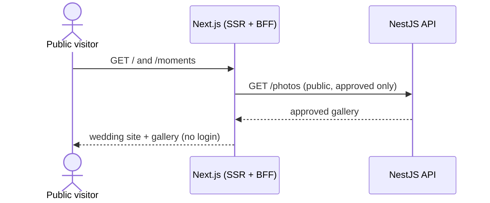
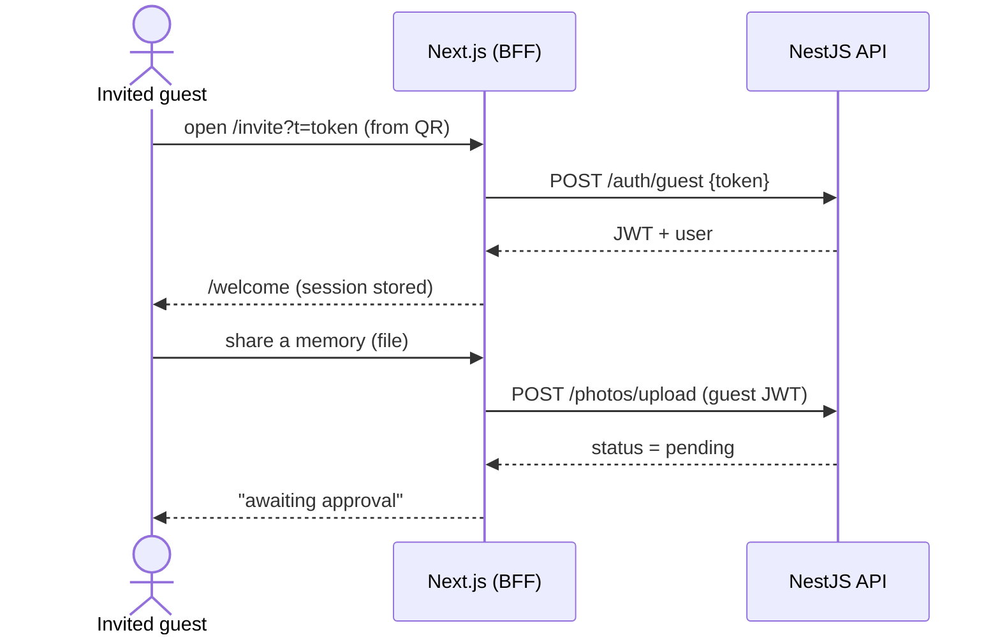
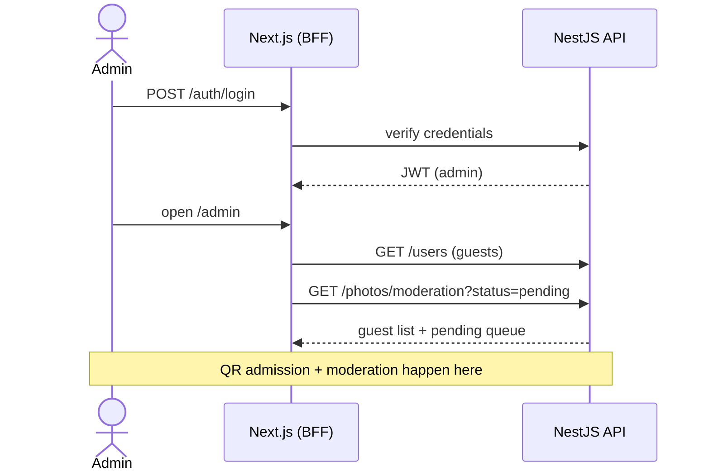

# Wedding App — Consolidation Architecture

> Status: **proposed, awaiting sign-off.** No application code has been changed.
> Companion document: [`MODERATION.md`](./MODERATION.md) (the moderation design in depth).
> Generated: 2026-07-10.

---

## 1. Why this document exists

The workspace currently holds three codebases that together solve one problem — a wedding website
with an invitation flow and a moderated, crowd-sourced photo gallery — but split across two frontends
and two backends with duplicated responsibilities and two incompatible auth models.

This document proposes a single, cohesive, production-ready **Next.js** application, explains the
reasoning, and lays out a phased migration. The guiding constraints (from the project owner):

- **Minimize unnecessary rewrites.** Preserve the working NestJS business logic (auth, QR invitations,
  guest management, admission) unless a significantly better alternative is justified.
- **Reuse the working Google Photos integration**, including its URL abstraction.
- **The centerpiece is moderation:** guest uploads must require admin approval before becoming
  publicly visible.
- **The approved gallery is public** — anyone can view approved media; authentication is required only
  to upload.

---

## 2. Current state

### 2.1 Frontend A — `src/` (NestJS-backed)

The *identity & operations* app. React + Vite + TanStack Query + axios.

- Real **JWT auth** with roles (`guest` / `admin` / `super_admin`); guest login exchanges a QR token
  for a JWT with one-device enforcement (`currentJti`).
- **Guest management** (CRUD), **QR-code generation**, and **entrance admission scanning**.
- Media lives in **Google Photos**; the backend hides Google's ~60-minute URL expiry behind a stable
  `/photos/:id/raw` 302 redirect.
- **Entirely login-gated** — there is no public surface, and guests see **only their own** photos.
- **No moderation** — uploads go live instantly.

Key files: [`src/App.tsx`](../src/App.tsx), [`src/context/AuthContext.tsx`](../src/context/AuthContext.tsx),
[`src/lib/api.ts`](../src/lib/api.ts), [`src/lib/queries.ts`](../src/lib/queries.ts).

### 2.2 Frontend B — `emmilove/` (Supabase-backed)

The *content & website* app. React + Vite + Tailwind + shadcn/ui + Supabase.

- A full **public wedding website** (Hero, Story, Proposal, Details, Video, Gift, RSVP, Footer).
- A **Moments** gallery with the moderation workflow to preserve: `pending → approved/rejected`
  enforced by Postgres RLS, **couple** auto-approve + crown badge, albums, anonymous uploads, and
  **client-side image compression** (`browser-image-compression`).
- **No real auth** — uploads are anonymous; the moderation admin is a **shared password** checked in a
  Supabase edge function ([`moments-admin`](../emmilove/supabase/functions/moments-admin/index.ts)).
- RSVP and Gift are non-functional stubs.

Key files: [`emmilove/src/pages/Moments.tsx`](../emmilove/src/pages/Moments.tsx),
[`emmilove/src/pages/AdminMoments.tsx`](../emmilove/src/pages/AdminMoments.tsx),
[`emmilove/supabase/migrations/`](../emmilove/supabase/migrations/).

### 2.3 Backend — `WeddingApp/` (NestJS)

The API behind Frontend A (present as compiled `dist/`; changes will land in the real backend repo).
Modules: `auth`, `users`, `google-photos`, `photos`. TypeORM (SQLite in dev), JWT + `RolesGuard`, a
global JWT guard with a `@Public()` opt-out.

The two facts that shape everything below:

- `PhotosService.list()` reads the **Google album index** (`PhotoCacheService.getIndex(albumId)`) and
  joins **`PhotoMeta`** (table `photo_meta`: `googlePhotoId` unique, `uploaderId`, `uploaderName`,
  `uploadedAt`) for attribution. **The album *is* the public set.**
- `PhotosService.uploadSingle/Bulk()` calls `google.batchCreate(albumId, …)`, adding items **straight
  into the shared album**. Fresh URLs are resolved **by media-item ID** (`batchGet`), independent of
  album membership.

---

## 3. Problems with the current split

| Responsibility | Frontend A | Frontend B | Consequence |
|---|---|---|---|
| Media storage | Google Photos | Supabase Storage | Two stores for the same media |
| Gallery read | `GET /photos` (album) | Supabase `uploads`+`media` | Two galleries |
| Auth / identity | JWT + roles | anonymous + shared password | Two auth models; B contradicts "authenticate to upload" |
| Moderation | — | Supabase `status` + RLS + edge fn | Only exists in B, and can't attribute an upload to a real guest |
| Upload | direct-to-album | Supabase + compress | Divergent flows |

Add to this: **neither app is Next.js**, **neither has both a public site and real auth**, and the
moderation admin's shared-password model is inconsistent with the JWT roles used everywhere else.

---

## 4. Recommended architecture

### 4.1 One Next.js application

A single **Next.js (App Router)** app replaces both Vite SPAs, built on **Tailwind + shadcn/ui** (the
design system where the richer UI already lives). It serves three audiences from one codebase:

```
/(public)            → wedding site (Hero, Story, Proposal, Details, Video, Gift, RSVP*)  [SSR, no auth]
/(public)/moments    → approved gallery (public read) + "Share a memory" (auth-gated action)
/invite              → QR target (?t=token) → guest JWT login → welcome        [ports GuestLanding]
/welcome             → post-login guest landing + avatar upload                [ports GuestWelcome]
/admin               → unified dashboard: Guests · Admission (QR) · Moderation [ADMIN]
/admin/qr/[guestId]  → entrance admission screen                               [ports QRValidate]
```

- **Design system:** Tailwind + shadcn/ui; re-skin Frontend A's functional components (Login,
  GuestLanding, GuestWelcome, AdminPanel, QRValidate, Gallery, Lightbox, UploadPanel) into it.
- **Auth / BFF:** port `AuthContext`/token handling; move token attachment and Google `/raw` proxying
  into **server route handlers** so secrets and headers stay server-side and the public site is
  SSR/SEO-able.
- **Upload:** authenticated; port `browser-image-compression`; guest uploads land as `pending`.
- **Admin:** one dashboard unifies Frontend A (guests + QR admission) and Frontend B (moderation) under
  the JWT admin role — **the shared password disappears**.
- **Anonymous option:** kept as a *display* toggle (hide name publicly), not true anonymity — moderators
  retain accountability.

### 4.2 One backend: extend NestJS, retire Supabase

The NestJS API becomes the single source of truth for **both** identity and moderation. Supabase is
**retired entirely** (database, storage, edge function, shared-password admin). Its value is portable:

- The moderation *workflow* becomes a `status` column on the existing `PhotoMeta`, guarded by the
  existing `RolesGuard` — not a new subsystem.
- The website is just React components; they move into Next.js regardless of backend.
- Image compression is a client library that ports directly.

Frontend A's auth/QR/guest/admission code is **untouched and only extended**, honoring the
minimize-rewrites constraint.

### 4.3 Keep Google Photos; moderate via the database (Approach A — implemented)

Google Photos and the `/photos/:id/raw` abstraction stay. Moderation is enforced by a **`status`
column in our database**, not by Google album membership. All uploads go into the couple's album at
upload time (their keepsake); a `PhotoMeta.status` (`pending`/`approved`/`rejected`) decides public
visibility. The public gallery is a **pure DB read** of approved rows, and `/photos/:id/raw` denies
non-approved photos. Approve/reject is a single DB update — **instant, no Google write**.

> This replaced an earlier album-membership design after a spike showed Google album operations are
> too slow (eventual consistency on approve) and partially blocked (append-only token scope can't
> remove from an album). Full detail, the spike findings, and trade-offs are in
> [`MODERATION.md`](./MODERATION.md). **This design is implemented and validated end-to-end.**

### 4.4 Topology and deployment

- **Next.js = frontend + thin BFF** (server route handlers), deployed on **Vercel**. The public site
  gets SSR/SEO; the BFF keeps tokens and Google proxying server-side.
- **NestJS = separate domain API**, deployed on a Node host (Render / Railway / Fly / VM), with
  **Postgres in production** (the backend defaults to SQLite for dev).
- One deployable frontend; the working backend stays intact. The API contract is versioned so the two
  repos can evolve independently.

---

### 4.5 Sequence diagrams — overall flows

**Public visitor** (no authentication):



**Invited guest** (authenticate, then upload):



**Admin** (one dashboard: guests, admission, moderation):



### 4.6 Repository boundary (working constraint)

> **The NestJS backend remains its own separate repository.** The copy under `WeddingApp/` in this
> workspace is **reference only** — used for implementation planning and API integration, not as a
> build target.
>
> - **Do not migrate backend business logic into the Next.js app.** Next.js is the frontend + a thin
>   BFF (auth token handling, request proxying, SSR); it must not absorb domain logic (auth, guests,
>   admission, Google Photos, moderation). Those live in the backend service and are consumed over HTTP.
> - **Backend changes are documented, not implemented here.** Every required backend change is specified
>   in [`BACKEND_IMPLEMENTATION_SPEC.md`](./BACKEND_IMPLEMENTATION_SPEC.md) for the backend team to
>   implement in the backend repository. This repo never edits backend code.
> - The `topology: Next.js frontend/BFF + separate NestJS API` decision in §4.4 is therefore a hard
>   boundary, not just a deployment preference.

---

## 5. Backend changes (implemented — Approach A)

Additive and backward-compatible; validated end-to-end. **5 files changed**; `GooglePhotosService` is
**unchanged** (no album-membership calls needed). See [`MODERATION.md`](./MODERATION.md) §5 for the full
contract and [`BACKEND_IMPLEMENTATION_SPEC.md`](./BACKEND_IMPLEMENTATION_SPEC.md) for the copy-to-repo list.

- **`photos/entities/photo-meta.entity.ts`**: add `status` (default `'approved'`, indexed), `source`
  (default `'guest'`), `isAnonymous`, and media metadata (`filename`, `mimeType`, `width`, `height`,
  `creationTime`). Default `'approved'` means a schema sync marks existing rows approved — **no
  backfill**; guest uploads set `pending` explicitly. SQLite dev auto-syncs; add a Postgres migration for prod.
- **`photos/photo-meta.service.ts`**: `saveMany` records per-item metadata + `{status, source,
  isAnonymous}`; add `findByStatus`, `findByStatusPaged`, `updateStatus`.
- **`photos/photos.service.ts`**: uploads always go to the album and store metadata (guest→`pending`,
  admin→`approved`/`couple`); `list()` is a pure DB read of approved rows; add `listModeration` and
  `setStatus` (DB-only); `resolveRawUrl` denies non-approved.
- **`photos/dto/list-photos.dto.ts`**: add `isAnonymous` to the upload DTO; add moderation query/patch DTOs.
- **`photos/photos.controller.ts`**: `GET /photos` → `@Public()`; add `GET /photos/moderation` and
  `PATCH /photos/:id/status` under `@Roles(ADMIN, SUPER_ADMIN)`; upload endpoints pass uploader role + `isAnonymous`.

**Deferred (YAGNI, to avoid scope creep):** named album grouping, RSVP persistence (`POST /rsvp`),
server-side likes. RSVP/Gift stay static initially.

---

## 6. Migration phases

Each phase is independently shippable and low-risk; the public website ships value before any backend
change is required.

| Phase | Scope | Backend change? |
|---|---|---|
| **0 — Scaffold** | Next.js App Router + Tailwind + shadcn, env/config, shared API client, BFF auth wiring | No |
| **1 — Public website** | Port emmilove sections; SSR/SEO | No |
| **2 — Auth + invitation** | QR guest login, welcome, admin login against existing NestJS | No |
| **3 — Moderation core** | `status`/`source` + album-membership moderation + endpoints (after the spike); admin moderation UI; public approved gallery; authenticated upload with compression | **Yes** |
| **4 — Consolidation & cutover** | One admin dashboard (guests + admission + moderation); retire `emmilove/` + Supabase; decommission the edge function | Cleanup |
| **5 — Optional** | Named albums, RSVP persistence, real likes, realtime gallery | Optional |

---

## 7. Risks & trade-offs

- **`albums:batchAddMediaItems` permissions** (app-created album + app-uploaded items). This is the one
  load-bearing assumption — **de-risk with a spike before building Phase 3.** Fallback: the staged-store
  approach (Approach C in `MODERATION.md`).
- **Google Photos API scope (2025 app-created-data restrictions).** The app only touches media it
  created, so it stays in scope — but "re-sync manually added photos" cannot see externally-added photos.
  Mitigation: flow all media through the app.
- **No Library API delete** → rejected media persists privately in the Google account (never public).
  Accept, or use Approach C.
- **SQLite → Postgres** for production concurrency (`synchronize` off in prod → run a migration).
- **Two-repo coordination** (Next.js + NestJS) — version the API contract.
- **Existing Supabase data** in project `dggcxuqadeqsneflleem`: add a one-time migration script at
  cutover if any real uploads exist (likely negligible pre-launch).

---

## 8. Verification (for the implementation phase)

1. **Spike (blocking):** on the real backend, create a media item with `batchCreate` **without** an
   `albumId`, confirm `/photos/:id/raw` resolves it (library-only), then `albums:batchAddMediaItems` it
   into the wedding album and confirm it appears in `GET /photos`. If this fails → adopt Approach C.
2. Public `GET /photos` returns only album (approved) items; a `pending` item is absent.
3. End-to-end: guest upload → `pending`, invisible publicly → admin approves → appears; admin rejects →
   never appears.
4. Auth: public browses the site and gallery with no token; upload requires a guest JWT; moderation
   requires an admin JWT (no shared password anywhere).
5. Build / lint / typecheck the Next.js app; Lighthouse pass on the public site (SSR/SEO).

---

## 9. What happens next

This architecture is presented for sign-off. **No application code will be written until it is
approved.** On approval, implementation proceeds phase by phase per §6, starting with the blocking
Google Photos spike from §8 before any moderation work.
