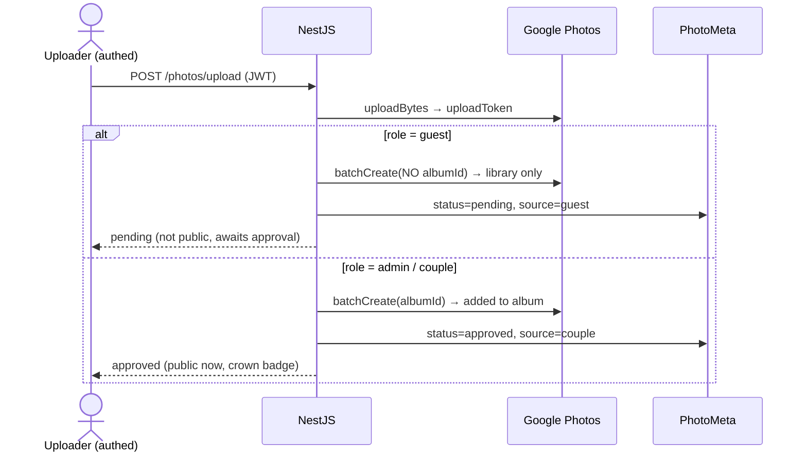
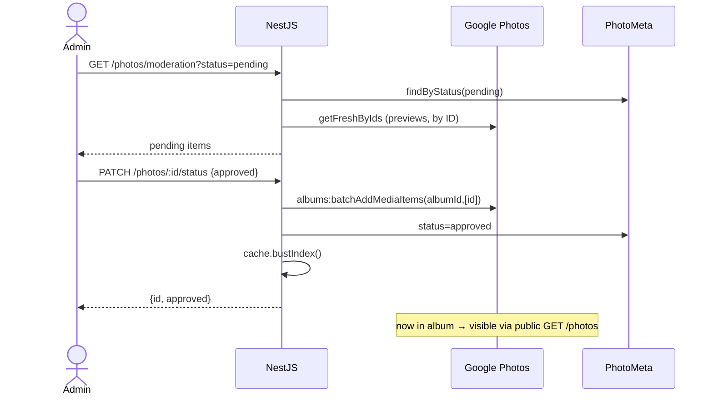

# Moderation Design — Approved-Before-Public

> Companion to [`ARCHITECTURE.md`](./ARCHITECTURE.md). This document explains, in depth, how guest
> uploads are held for admin approval before becoming publicly visible, why the recommended approach
> was chosen over the alternatives, and the exact backend contract it requires.
> Generated: 2026-07-10.

---

## 1. The requirement

- Guests **authenticate** (via the existing QR invitation flow) before they can upload.
- A guest upload is **not publicly visible** until an **admin approves** it.
- The **approved gallery is public** — anyone can view approved media without authenticating.
- **Couple/admin uploads** bypass the queue (auto-approved), display with a crown badge, and sort first.
- Reuse the existing Google Photos integration and its URL abstraction as much as possible.

---

## 2. The core constraint: Google Photos has no "pending" state

The existing backend already tells us exactly what we're working with:

- **The gallery reads the Google album.** `PhotosService.list()` pages over the album index from
  `PhotoCacheService.getIndex(albumId)` and joins `PhotoMeta` for attribution. Whatever is *in the
  album* is what the public sees.
- **Uploads go straight into the album today.** `PhotosService.uploadSingle/Bulk()` calls
  `google.batchCreate(albumId, …)`, which creates the media item **and** adds it to the album in one step.
- **Fresh URLs are resolved by media-item ID.** `PhotoCacheService.getFreshByIds()` → `batchGet(ids)`
  fetches a fresh, non-expiring-from-the-client's-view URL for any media item the app owns —
  **independent of album membership**.
- **A metadata table already exists.** `PhotoMeta` (`photo_meta`) is keyed by `googlePhotoId` and holds
  `uploaderId` / `uploaderName` / `uploadedAt`. It is the natural, already-present home for a `status`.

Google Photos itself has no notion of a "pending" item. Therefore moderation must be enforced by
controlling **album membership**, with the app's own `status` column as the system of record for what
has been reviewed.

---

## 3. Approaches considered

### Approach A — Status overlay on the single shared album (rejected)

Keep uploading straight into the album; add `PhotoMeta.status`; have the public list filter out
non-approved items; gate `/raw` per item.

- ❌ Pending guest uploads are **immediately in the couple's real album**, so the couple (and anyone the
  album is shared with) sees unmoderated content the moment it's uploaded.
- ❌ `GET /photos/:id/raw` is public; a pending item's raw URL would be reachable, so the "not visible"
  guarantee would depend on new per-item authorization.
- ❌ The public list has to reconcile the album index against `PhotoMeta` status on every read.

Weakest guarantee, most special-casing. **Not recommended.**

### Approach B — Album-membership moderation (recommended)

Separate "created" from "in the album." Pending items live in the account **library only**; approval
**adds** them to the album.

**Guest upload**
1. `google.uploadBytes(...)` → upload token (unchanged).
2. `google.batchCreate(null, …)` — **omit `albumId`** → the media item is created in the account
   library but **not** added to the album.
3. `PhotoMeta` row written with `status='pending'`, `source='guest'`, `uploaderId`, `uploaderName`.

**Public read** — `GET /photos` reads the album index, which does not contain pending items, so they
are invisible with **zero change to the read path or `/raw`**.

**Admin moderation queue** — `GET /photos/moderation?status=pending` reads `PhotoMeta` by status and
resolves previews via the existing `PhotoCacheService.getFreshByIds()` (works by ID, not album).

**Approve** — `google.batchAddMediaItems(albumId, [id])` + `PhotoCacheService.bustIndex()` +
`status='approved'`. The item now appears in the public gallery on the next index sync.

**Reject** — `status='rejected'`; the item is never added to the album.

**Couple/admin upload** — `batchCreate(albumId, …)` as today + `status='approved'`, `source='couple'`.

**Why this wins**
- ✅ **No new storage** and **no new provider** — Google Photos stays the only media store.
- ✅ **The public read path and `/raw` are untouched** — the album literally *is* the approved set.
- ✅ **Reuses the existing upload code** — only the album-add step moves from upload time to approval time.
- ✅ **True not-visible-until-approved** guarantee for the public gallery.
- ✅ Lands in the **already-existing `PhotoMeta` layer** — moderation is an extension, not a new subsystem.

**Trade-offs to accept**
- The Google **library** (not the album / public gallery) will hold unapproved and rejected items.
- The Google Photos **Library API has no media-item delete**, so rejected media lingers privately in the
  account. For a personal wedding app with modest volume, this is acceptable.

### Approach C — Staged external store (fallback)

Hold pending bytes in a small object bucket or on backend disk; on approval, run the existing Google
upload to place the item into the album.

- ✅ The Google account is **only ever touched by approved media** — the library stays pristine.
- ✅ Rejected bytes can be **truly deleted** from the staging store.
- ➖ Adds a second storage location and moves the (re-)upload step to approval time.

**Choose C only if** unapproved media must never touch the Google account at all. Otherwise Approach B
is simpler and reuses more.

---

## 4. Decision

**Approach B (album-membership moderation)** is recommended: it satisfies the public-visibility
guarantee — the actual requirement — with the least new infrastructure and the most reuse, sitting
inside the metadata layer that already exists. Approach C is the documented fallback if the couple's
Google *library* cleanliness (or true deletion of rejected media) turns out to be a hard requirement.

The decision rests on one Google-side assumption that must be validated first (see §6).

---

## 5. Backend contract (Approach B)

### Data model — `PhotoMeta`

| Column | Type | Default | Notes |
|---|---|---|---|
| `googlePhotoId` | varchar, unique | — | existing |
| `uploaderId` | varchar, nullable | — | existing (from JWT `sub`) |
| `uploaderName` | varchar, nullable | — | existing |
| `uploadedAt` | timestamp | now | existing |
| **`status`** | varchar | `'pending'` | **new** — `pending` / `approved` / `rejected` |
| **`source`** | varchar | `'guest'` | **new** — `guest` / `couple` |
| **`isAnonymous`** | boolean | `false` | **new, optional** — display-only; upload stays attributed internally |

### Endpoints

| Method | Path | Guard | Behaviour |
|---|---|---|---|
| `GET` | `/photos` | **`@Public()`** | Paginated approved gallery (album index). Now public. |
| `POST` | `/photos/upload`, `/photos/upload/bulk` | JWT (any role) | Guest → library-only + `pending`. Admin/couple → album + `approved`/`couple`. |
| `GET` | `/photos/moderation?status=` | `@Roles(ADMIN, SUPER_ADMIN)` | Lists `PhotoMeta` by status with resolved preview URLs. |
| `PATCH` | `/photos/:id/status` | `@Roles(ADMIN, SUPER_ADMIN)` | `approved` → `batchAddMediaItems` + `bustIndex`; `rejected` → status only. |
| `GET` | `/photos/:id/raw` | `@Public()` | Unchanged. Optional hardening: 404 for non-approved unless admin. |

### Google client additions — `GooglePhotosService`

- `batchCreate(albumId?: string | null, items)` — when `albumId` is null/undefined, omit it from the
  `mediaItems:batchCreate` body (library-only create).
- `batchAddMediaItems(albumId, mediaItemIds)` — `POST /v1/albums/{albumId}:batchAddMediaItems` with
  `{ mediaItemIds }`.

---

## 6. Validation before building (blocking spike)

Before implementing Phase 3, confirm the load-bearing Google behaviour against the real backend and the
real wedding Google account:

1. `batchCreate` **without** an `albumId` creates a media item (returns an ID) that is **not** in the album.
2. `GET /photos/:id/raw` (via `getFreshByIds` → `batchGet`) resolves that library-only item.
3. `albums:batchAddMediaItems(albumId, [id])` succeeds for the **app-created** wedding album and an
   **app-uploaded** item, and the item then appears in `GET /photos`.

If step 3 fails (e.g. due to Google's app-created-data constraints), switch to **Approach C** without
changing anything else in the architecture — the frontend, data model, and endpoint shapes stay the
same; only where pending bytes live changes.

---

## 7. End-to-end behaviour (target)

```
Guest (authenticated) uploads a photo
  → created in Google library only, PhotoMeta.status = 'pending'
  → NOT in the album → invisible in the public /moments gallery

Admin opens /admin → Moderation tab
  → GET /photos/moderation?status=pending  (admin JWT)
  → previews render via /raw

Admin approves
  → albums:batchAddMediaItems + bustIndex + status = 'approved'
  → next index sync → photo appears in the public gallery, attributed to the guest
    (or "Anonymous" if isAnonymous), no crown badge

Admin rejects
  → status = 'rejected' → never added to the album → never public

Couple/admin uploads
  → straight into the album, status = 'approved', source = 'couple'
  → public immediately, crown badge, sorts first
```

No shared password anywhere — every privileged action is a JWT admin role check.

---

## 8. Sequence diagrams

**Upload** — guest lands as `pending`; couple/admin auto-publishes:



**Approval** — admin reviews the queue and publishes:



**Rejection** — never publish (pending) or un-publish (approved):

```mermaid
sequenceDiagram
    actor A as Admin
    participant API as NestJS
    participant GP as Google Photos
    participant DB as PhotoMeta
    A->>API: PATCH /photos/:id/status {rejected}
    alt was pending
        API->>DB: status=rejected (never added to album)
    else was approved
        API->>GP: albums:batchRemoveMediaItems(albumId,[id])
        API->>DB: status=rejected
        API->>API: cache.bustIndex()
    end
    API-->>A: {id, rejected}
    Note over GP: bytes remain private in library (no API delete); never public
```
