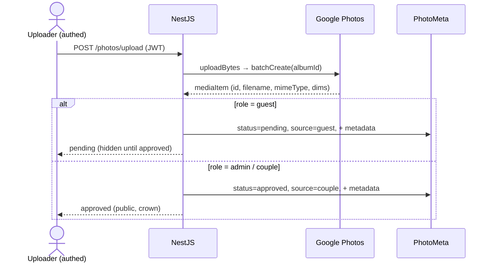
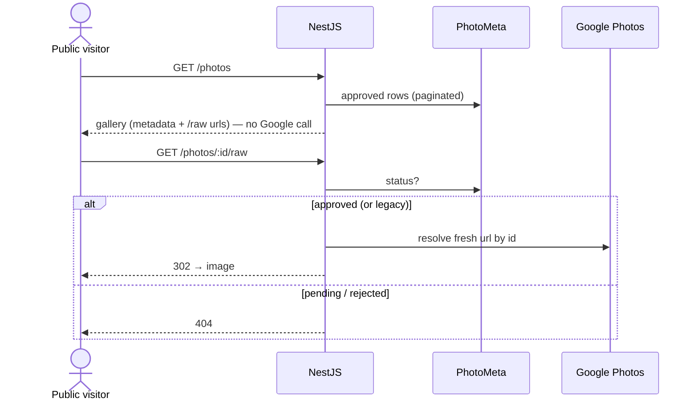
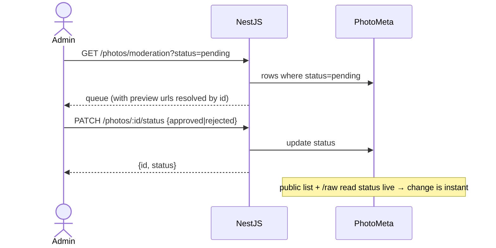

# Moderation Design — Approved-Before-Public

> Companion to [`ARCHITECTURE.md`](./ARCHITECTURE.md). How guest uploads are held for admin
> approval before becoming publicly visible.
>
> **Status: implemented and validated end-to-end** against the real Google Photos account on a
> local backend (2026-07-11). The design below (**Approach A — DB as source of truth**) is what was
> built. It replaced the originally-proposed album-membership approach after a spike revealed two
> hard problems with it (see §3).

---

## 1. The requirement

- Guests **authenticate** (via the QR invitation flow) before they can upload.
- A guest upload is **not publicly visible** until an **admin approves** it.
- The **approved gallery is public** — anyone can view approved media without authenticating.
- **Couple/admin uploads** are auto-approved (`source: couple`, crown badge).
- Reuse the existing Google Photos integration.

---

## 2. The constraint that shaped everything

Google Photos has **no native "pending" state** — and, as the spike proved, two related quirks:

1. **Album membership is eventually consistent.** Adding/creating an item in an album does not make
   it appear in the album's `mediaItems:search` results immediately — it can lag seconds to minutes.
2. **The refresh token's scope is append-only.** It can *add* media to the app-created album but
   **cannot remove** them (`albums:batchRemoveMediaItems` → `403 insufficient authentication scopes`).

So a moderation design that toggles album membership on approve/reject is both **slow** (approve
doesn't show immediately) and **partially blocked** (can't un-publish). The chosen design avoids
touching album membership for moderation entirely.

---

## 3. Approaches considered (and what the spike found)

**Approach B — album-membership gating** *(originally recommended, then rejected)*
Guest uploads go to the account library only; approve = add to album; reject = remove from album.
The spike (real Google account, local backend) found:
- ✗ **Approve is not immediate** — `batchAddMediaItems` succeeds, but the item lags in album search,
  so the public gallery doesn't show it promptly.
- ✗ **Un-approve is impossible** — `batchRemoveMediaItems` → 403 (append-only scope).
Both are inherent to Google, not fixable in our code (short of re-minting the token with an edit
scope, and even then the propagation lag remains). **Rejected.**

**Approach A — DB is the source of truth** *(chosen & implemented)*
All uploads go into the album at upload time (as the original app did). A `status` column in our
database — not album membership — decides public visibility. Moderation is a pure DB update:
instant, reliable, no Google write, no scope requirement, no propagation lag.

---

## 4. The implemented design (Approach A)

**Upload** (guest or couple) → `mediaItems:batchCreate(albumId, …)` puts the photo in the couple's
album immediately (their keepsake), and a `PhotoMeta` row is written with:
- `status` = `pending` for guests, `approved` for couple/admin
- `source` = `guest` / `couple`, `isAnonymous` flag
- **the media metadata** (`filename`, `mimeType`, `width`, `height`, `creationTime`) captured from the
  upload response

**Public gallery** (`GET /photos`, public) is a **pure DB read**: it returns approved `PhotoMeta`
rows (paginated), built straight from the stored metadata — **no Google API call per request**.
Images themselves load on demand through `GET /photos/:id/raw`.

**`GET /photos/:id/raw`** (public) resolves a fresh Google URL by media-item id, but **denies
non-approved photos**: if the item's `PhotoMeta.status` is `pending`/`rejected` it returns 404. Legacy
items with no `PhotoMeta` row are treated as approved.

**Moderation queue** (`GET /photos/moderation?status=`, admin) reads `PhotoMeta` by status and
resolves a fresh Google URL **by id** for each (so admins can preview `pending` items even though
`/raw` denies them publicly — the queue returns the image URL directly in the response).

**Approve / reject** (`PATCH /photos/:id/status`, admin) is a **single DB update** of `status`.
Because the public list and `/raw` both read that status live, the change is **instant** — approve,
reject, and even un-publish (approved→rejected) all take effect on the next request with no Google
call.

### Trade-offs accepted
- Pending/rejected photos physically remain in the couple's Google album (hidden from the site and
  from `/raw`). The Library API can't delete media items, so rejected media lingers privately in the
  Google account. The couple can remove them in Google Photos if they wish. *(Accepted by the owner.)*
- The gallery shows **app-uploaded** photos (those with a `PhotoMeta` row). Photos added to the Google
  album by hand won't appear — which is correct for an app-managed, moderated gallery.

---

## 5. Backend contract (as built)

### `PhotoMeta` (table `photo_meta`) — new columns
| Column | Type | Default | Purpose |
|---|---|---|---|
| `status` | varchar (indexed) | `'approved'` | `pending`/`approved`/`rejected`. Default `approved` so a schema sync marks existing rows approved — **no manual backfill**; guest uploads set `pending` explicitly. |
| `source` | varchar | `'guest'` | `guest`/`couple` (crown badge). |
| `isAnonymous` | boolean | `false` | Hide uploader name publicly (still attributed internally). |
| `filename`, `mimeType`, `width`, `height`, `creationTime` | varchar/int | null | Media metadata so the gallery is a pure DB read. Null for legacy rows. |

### Endpoints
| Method | Route | Auth | Behaviour |
|---|---|---|---|
| `GET` | `/photos` | **Public** | Approved gallery, paginated, from the DB. `pageSize` max 100. |
| `GET` | `/photos/moderation?status=` | ADMIN+ | Queue by status; items include a resolved image URL for preview. |
| `PATCH` | `/photos/:id/status` | ADMIN+ | Body `{ status: 'approved' \| 'rejected' }`. DB-only, instant. |
| `POST` | `/photos/upload`, `/upload/bulk` | any auth | multipart `file(s)`, `description?`, `isAnonymous?`. Guest→`pending`, admin→`approved`/`couple`. |
| `GET` | `/photos/:id/raw` | Public | 302 to fresh URL for approved; **404 for non-approved**. |

> **Note:** Google's `albums:batchAddMediaItems` / `batchRemoveMediaItems` are **not used** — the
> implemented `GooglePhotosService` is unchanged from the original. This is why the append-only token
> scope is sufficient and no token re-mint is needed.

---

## 6. Validation (done, not pending)

Run against the real Google account on a local backend, all passing:
- Guest upload → `pending`, absent from public list, `/raw` → 404.
- Approve → **instantly** in public list (status `approved`), `/raw` → 302, gone from pending queue.
- Reject → absent from public, `/raw` → 404, in rejected queue.
- Un-publish (approved→rejected) → **instantly** removed from public, `/raw` → 404.
- Public list stable across repeated calls (no Google dependency, no flakiness).

---

## 7. Sequence diagrams

**Upload** — guest lands `pending`, couple auto-approved; both go into the album:

**Public view** — pure DB read; images gated by status:

**Moderate** — instant DB status change:

